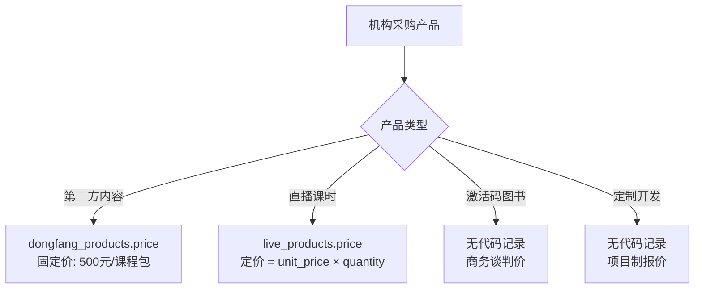
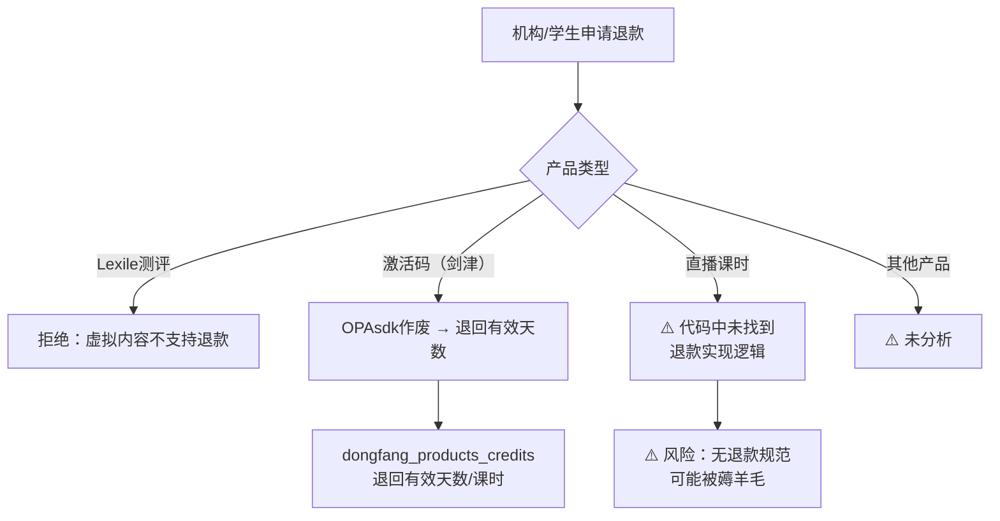

# iPlayABC 商业闭环补充：定价 / 退款 / 账期

> 生成时间: 2026-04-30
> 分析方法: 代码逆向提取 + 已知业务规则
> 数据来源: dongfang_products / live_products / school_orders / sdk-auth-code.service.ts
> 可信度: 中（代码可见部分 + 已知业务规则，账期完全缺失）

---

## 一、产品定价体系

### 1.1 定价在哪里

| 产品类型 | 价格存储位置 | 说明 |
|---------|------------|------|
| **东方之星课程（第三方）** | `dongfang_products.price` | 固定 50000（500元），180天 |
| **直播课时包** | `live_products.price`（分） | 按课时数定价 |
| **雪梨/剑津图书激活码** | ❌ 代码中无 price | 可能是商务谈判价 |
| **打卡营/其他产品** | ❌ 代码中无 price | 待补充 |

**已知定价案例**：
```javascript
// 东方之星课程（第三方内容）
price: 50000  // 500元（单位：分）
days: 210     // 210天使用期

// 直播课时包（live_products 表）
price: ???    // 待查（代码中 live_products.price 是存在的）
unit_price: ??? // 单课时价格（分）
quantity: ???   // 课时数
```

---

### 1.2 定价模型分析



### 1.3 缺失的定价逻辑

| 问题 | 影响 |
|------|------|
| Syllabus 没有 price 字段 | 无法在系统内查询课程价格 |
| 价格由谁维护？（运营？销售？） | 职责不清 |
| 多产品线价格是否统一管理？ | 可能存在价格混乱 |
| 折扣体系？（批量折扣/续费折扣） | 代码中未找到折扣逻辑 |

---

## 二、退款政策

### 2.1 已知的退款规则

#### 规则 1：Lexile 测评（虚拟内容，不支持退款）

```javascript
// lexile_test_package/lib/core/config/app_texts.dart
'4. 本测评为虚拟内容服务，购买后不支持退款。'
'4. This assessment is a virtual content service, and no refund after purchase.'
```

#### 规则 2：激活码作废后可退回天数（剑津新体系）

```typescript
// jianjinjiaoyu/opa/libs/sdk-auth-code/src/api/sdk-auth-code.service.ts

// 作废激活码时，退回有效天数
const refundChargeName = this.calculateRefundChargeName(authCode.validDays);
description: `作废激活码退回（激活码：${authCode.code}，有效期：${refundChargeName}天，退回：1）`,
chargeName: refundChargeName,
```

**含义**：剑津 OPA 体系支持激活码作废后**退回剩余有效天数**（可能是退回机构账户）。

#### 规则 3：直播课未消耗课时

```javascript
// 直播订单状态机
status: 0=None, 1=未支付, 2=已支付, 3=过期, 4=转入退款, 5=已关闭, 6=已撤销, 7=用户支付中, 8=支付失败

// 退款触发：status=4（转入退款）
```

**⚠️ 问题**：代码中未找到直播课时退款的具体实现逻辑。`live_lessons_consume_details` 只有扣减记录，没有退款记录表。

---

### 2.2 退款流程推断



---

### 2.3 退款风险分析

| 风险 | 描述 | 优先级 |
|------|------|--------|
| **直播课退款无规范** | 未消耗课时能否退？退多少？由谁审批？代码中完全没有 | 🔴 P0 |
| **激活码退款不追溯** | 作废激活码后已开通的记录不受影响，但如果机构未激活，退款如何处理？ | 🟡 P1 |
| **图书激活码退款** | 雪梨模式下，图书已售出后激活码能否退款？ | 🟡 P1 |
| **分销订单退款** | haoqihao 分销体系，订单退款后佣金会退回（status=-1），但机构侧如何处理？ | 🟡 P1 |

---

## 三、账期体系

### 3.1 代码中的账期相关线索

| 字段/表 | 含义 | 说明 |
|--------|------|------|
| `live_orders.status` | 订单状态 | 8种状态，含"用户支付中" |
| `dongfang_school_credits.available_count` | 机构可用课时余额 | 信用额度概念 |
| `live_org_extension` | 机构课时预购 | 先买后用 |

### 3.2 账期模式推断

**模式 1：预付（直播课时）**

```javascript
// 机构先购买课时包（live_orders）
// 课时进入 live_org_extension（总课时 - 已用）
// 学生上课后按实际上课分钟数扣减

// 预付流程：
机构付款 → live_orders（已支付）→ live_org_extension（总课时增加）→ 消耗
```

**模式 2：信用额度（机构课时账户）**

```javascript
// dongfang_school_credits 表
available_count: 可用课时数（信用额度）
used_count: 已用课时数

// 先消费，后结算（如果有账期）
// ⚠️ 但代码中没有账期相关字段（应付账款/结算日期等）
```

### 3.3 账期缺失分析

| 问题 | 影响 | 优先级 |
|------|------|--------|
| **没有账期字段** | 不知道平台给机构的账期是多长（月结？季结？） | 🔴 P0 |
| **没有应收账款表** | 无法在系统内跟踪机构欠款 | 🔴 P0 |
| **没有结算记录表** | 机构付款和系统订单的对应关系不清晰 | 🟡 P1 |
| **财务对账依赖人工** | 可能存在财务漏洞 | 🟡 P1 |

---

## 四、商业闭环数据流（修正版）

### 4.1 修正后的资金流

```mermaid
flowchart LR
    subgraph 付款阶段
        A1[机构付款] --> A2["live_orders
        status=2（已支付）"]
    end

    subgraph 履约阶段
        A2 --> A3["live_org_extension
        total_hours++"]
        A3 --> A4[学生上课]
        A4 --> A5["live_lessons_consume_details
        used_hours++"]
    end

    subgraph 退款阶段（⚠️ 缺失）
        A6[申请退款] --> A7{"产品类型"}
        A7 -->|Lexile| A8[拒绝：虚拟内容]
        A7 -->|激活码| A9[退回有效天数]
        A7 -->|直播课时| A10["⚠️ 未找到
        退款实现"]
    end

    subgraph 账期阶段（⚠️ 缺失）
        A11[应收账款] --> A12["⚠️ 无账期字段
        人工对账？"]
    end
```

### 4.2 财务相关表清单

| 表名 | 用途 | 完整度 |
|------|------|--------|
| `live_orders` | 直播课订单 | ⭐⭐⭐⭐ 较完整 |
| `live_products` | 直播产品定价 | ⭐⭐⭐ 中（有 price/unit_price） |
| `dongfang_products` | 机构产品授权 | ⭐⭐⭐ 中（有 price/days） |
| `dongfang_products_credits` | 机构产品账户 | ⭐⭐⭐ 中 |
| `dongfang_school_credits` | 机构课时信用 | ⭐⭐ 中 |
| `live_lessons_consume_details` | 课时消耗明细 | ⭐⭐⭐⭐ 较完整 |
| **应收账款表** | 机构欠款跟踪 | ⭐ 缺失 |
| **结算记录表** | 付款-订单对应 | ⭐ 缺失 |
| **退款记录表** | 退款流水 | ⭐ 缺失 |

---

## 五、行动项

| 优先级 | 行动 | 负责人 | 状态 |
|--------|------|--------|------|
| 🔴 P0 | 补充直播课退款规范（明确：未消耗课时能否退、退多少、谁审批） | 商务/法务 | 待办 |
| 🔴 P0 | 建立账期管理制度（明确：账期长度、结算日、逾期处理） | 财务 | 待办 |
| 🔴 P0 | 建立应收账款跟踪机制（避免机构欠款无法追溯） | 财务/技术 | 待办 |
| 🟡 P1 | 给 syllabus 表补充 price 字段（或建立价格主数据表） | 技术/运营 | 待办 |
| 🟡 P1 | 建立退款记录表（dongfang_refund_log） | 技术 | 待办 |
| 🟡 P1 | 确认雪梨图书激活码的定价机制 | 商务 | 待办 |

---

## 六、附录：已知定价数据点

| 产品 | 价格 | 单位 | 来源 |
|------|------|------|------|
| 东方之星课程包 | 500 | 元/课程包 | `dongfang_products.price = 50000`（分） |
| 东方之星使用期 | 210 | 天 | `dongfang_products.days = 210` |
| 雪梨图书激活码 | ❌ 无数据 | - | 待商务确认 |
| 剑津激活码 | ❌ 无数据 | - | 待商务确认 |
| 直播课时包 | ❌ 无数据 | - | `live_products` 表待查 |
| Lexile 测评 | ❌ 无数据 | - | 待查 |

---

*文档版本: v1.0*
*分析可信度: 中（代码可见部分 + 已知业务规则，账期完全缺失）*
*建议: 与销售/财务/法务团队核对实际商务条款*
