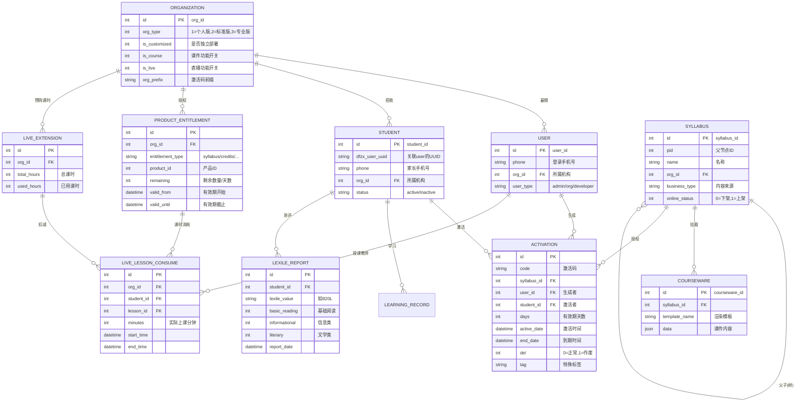
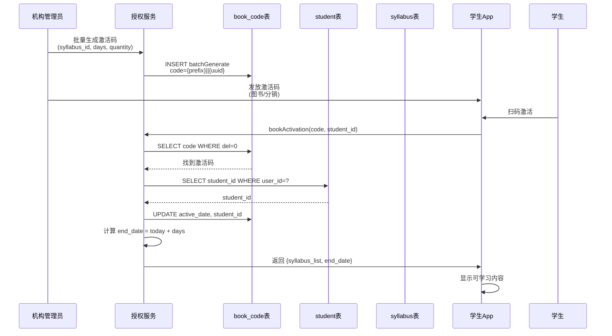
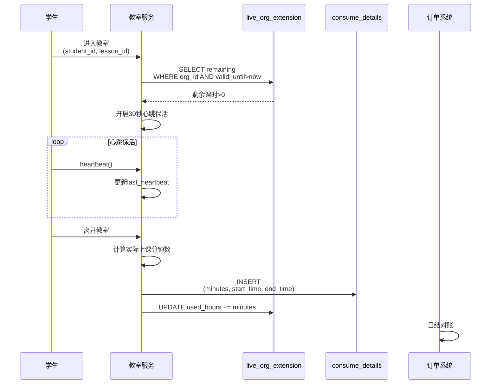
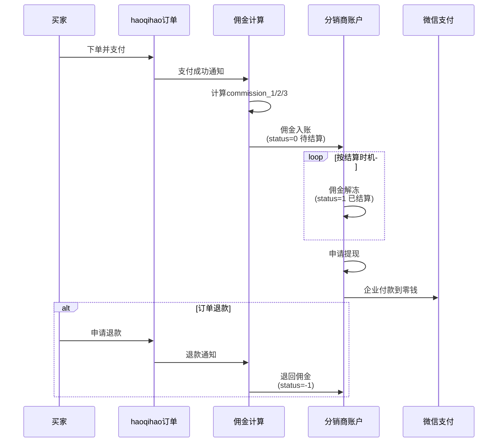

# iPlayABC 数据架构

> 生成时间: 2026-04-30
> 方法论: TOGAF C 层（数据架构）
> 执行内容: 逻辑数据模型 + 数据架构原则 + 数据治理 + ER 图

---

## 一、TOGAF C 层执行说明

TOGAF 数据架构（Data Architecture）关注：**什么数据在哪里、如何流动、由谁负责**。

TOGAF C 层要求四个产出物：

| TOGAF C 层产出物 | 本文执行状态 | 说明 |
|-----------------|------------|------|
| **1. 逻辑数据模型** | ✅ 已执行 | 核心实体 + 关系 + 业务规则 |
| **2. 数据架构原则** | ✅ 已执行 | 5 条数据宪法 |
| **3. 数据流转图** | ✅ 已执行 | 3 条关键业务流程的数据流 |
| **4. 数据治理** | ✅ 已执行 | 数据 Owner + 质量规则 + 孤岛分析 |

---

## 二、数据架构原则（Data Architecture Principles）

这是数据的"宪法"，所有数据决策必须符合这 5 条原则：

### 原则 1：机构数据隔离（Data Sovereignty）

> 机构数据属于机构，未经授权不得跨机构流动。

**推论**：
- 每个机构有独立的 `org_id`
- 所有业务表必须有 `org_id` 字段
- 数据查询必须带 `org_id` 过滤
- 跨机构数据分析需脱敏后汇总

**违反检测**：
```sql
-- 违反：没有 org_id 过滤的查询
SELECT * FROM student;  -- ❌ 应强制要求 WHERE org_id = ?

-- 合规
SELECT * FROM student WHERE org_id = 11;  -- ✅
```

---

### 原则 2：单一数据来源（Single Source of Truth）

> 每个核心业务实体只有一个系统负责写入。

**iPlayABC 的 SSOT 分配**：

| 实体 | 单一数据来源 | 消费者 |
|------|------------|--------|
| Organization | organization 表 | 所有系统 |
| User | user 表（老体系）/ jianjin-user（剑津新体系） | 所有系统 |
| Student | student 表 | 所有系统 |
| Syllabus | syllabus 表 | 内容运营系统 |
| Activation/Entitlement | book_code（旧）/ jianjin-course-entitlement（剑津） | 授权系统 |
| Order | live_orders（直播）/ dongfang_products_credits（产品） | 订单系统 |
| Lexile Report | lexile_test_report | 测评系统 |

**问题**：同一实体在旧体系和新体系都有副本（剑津迁移中），需要数据同步机制。

---

### 原则 3：数据可追溯（Data Provenance）

> 每条业务数据必须能够回答：谁（Who）、什么时候（When）、从哪里来（Where）。

**追溯要求**：

| 数据类型 | Who | When | Where |
|---------|-----|------|-------|
| 激活码 | creator_id（生成者） | active_date | org_prefix |
| 订单 | org_id | created_at | 哪个微服务创建 |
| 课时消耗 | student_id | consume_time | live_lessons_consume_details |
| 分销佣金 | buyer_id | order_time | commission_1/2/3 |

**违反场景**：
- ❌ 激活码和付款记录没有绑定关系 → 钱从哪来无法追溯
- ❌ 账期字段缺失 → 应收账款无法跟踪

---

### 原则 4：实时优先，最新数据优先（Currency Over History）

> 核心业务数据（如余额、课时、权限）必须实时准确；历史数据可异步记录。

**应用场景**：

| 场景 | 实时要求 | 实现方式 |
|------|---------|---------|
| 机构课时余额 | 必须实时 | `live_org_extension.total_hours - used_hours` 事务保证 |
| 激活码有效期 | 必须实时 | OPA 鉴权缓存 6 小时 |
| 学习进度 | 可异步 | `dongfang_syllabus_visits` 心跳异步写入 |
| 财务报表 | 异步 | 日结/周结，不要求实时 |

---

### 原则 5：数据资产分级（Data Classification）

> 不是所有数据同等重要。按业务影响分级保护。

| 等级 | 定义 | 数据类型 | 保护要求 |
|------|------|---------|---------|
| **P0 核心** | 丢失或泄露直接造成财务损失 | 订单、佣金、课时余额、激活码 | 事务保证、加密、审计日志 |
| **P1 重要** | 丢失影响运营，但可恢复 | 学生档案、成绩报告、内容 | 定时备份、操作日志 |
| **P2 普通** | 丢失不影响核心业务 | 浏览记录、心跳日志 | 常规备份 |

---

## 三、逻辑数据模型（Logical Data Model）

### 3.1 核心实体及其关系



---

### 3.2 数据流架构

```mermaid
flowchart TB
    subgraph 接入层["接入层"]
        APP["学生 App"]
        WEB["机构管理后台"]
        MINI["小程序/H5"]
    end

    subgraph 服务层["服务层"]
        subgraph 旧体系["旧体系（Koa/Express）"]
            OLD_ENT["授权服务\nbook_code/activation"]
            OLD_ORDER["订单服务\nlive_orders"]
            OLD_USER["用户服务\nuser/student"]
        end
        subgraph 新体系["新体系（NestJS+NATS）"]
            NEW_ENT["jianjin-course-\nentitlement"]
            NEW_USER["jianjin-user"]
            NEW_SCHEDULE["jianjin-schedule"]
        end
    end

    subgraph 数据层["数据层"]
        DB_OLD["MySQL\n(旧体系DB)"]
        DB_NEW["MySQL\n(新体系DB)"
        note:"每服务独立DB"]
        OSS["OSS\n课件/资源"]
        REDIS["Redis\n缓存/会话"]
    end

    subgraph 外部系统["外部系统"]
        HAOQIHAO["haoqihao\n分销系统"]
        WECHAT["微信支付\n支付宝"]
    end

    APP --> OLD_ENT
    APP --> OLD_USER
    WEB --> OLD_ENT
    WEB --> OLD_ORDER
    NEW_ENT --> DB_NEW
    NEW_USER --> DB_NEW
    NEW_SCHEDULE --> DB_NEW
    OLD_ENT --> DB_OLD
    OLD_ORDER --> DB_OLD
    OLD_USER --> DB_OLD
    NEW_ENT ...> OLD_ENT
    NEW_USER ...> OLD_USER
    NEW_SCHEDULE ...> OLD_ORDER
    HAOQIHAO -.->|佣金结算| OLD_ORDER
    WECHAT -.->|支付| OLD_ORDER
```

---

## 四、关键数据流转详解

### 4.1 授权数据流（Activation Flow）



**数据正确性规则**：
1. `del=1` 的激活码不能使用
2. 同一个 student_id 同一 syllabus 14 天试用只能一次
3. `end_date < now()` 时自动失效

---

### 4.2 直播课时消耗流（Live Class Consume Flow）



**数据正确性规则**：
1. `minutes < 10` 时按 10 分钟计费（最小计费单位）
2. 离开超过 N 分钟判定超时，自动下课
3. `used_hours` 不得超过 `total_hours`（需事务保证）

---

### 4.3 分销佣金流（Commission Flow）



---

## 五、数据治理

### 5.1 数据 Owner

| 数据类型 | Owner | Steward | 系统 |
|---------|-------|---------|------|
| Organization | 商务团队 | 运营 | organization 表 |
| User/Student | 技术/安全 | 产品 | user/student 表 |
| Syllabus/Courseware | 内容运营 | 教研 | syllabus/courseware 表 |
| Activation | 运营 | 客服 | book_code/entitlement 表 |
| Order/Finance | 财务 | 商务 | live_orders/finance 表 |
| Lexile Report | 教研 | 测评组 | lexile_test_report 表 |
| Commission | 商务 | 运营 | haoqihao 分销表 |

### 5.2 数据质量规则

| 规则 | 检查点 | 实现 |
|------|--------|------|
| `org_id` 非空 | 所有业务表 | 数据库约束 + API 校验 |
| 激活码唯一 | `code` 字段 | 唯一索引 |
| 课时不超扣 | `used_hours <= total_hours` | 应用层事务 |
| 有效期校验 | `end_date >= now()` | API 层校验 |
| 退款状态同步 | 退款时佣金状态 | 消息队列触发 |

### 5.3 数据孤岛分析

| 孤岛 | 影响 | 解决建议 |
|------|------|---------|
| **激活码 ↔ 付款无绑定** | 无法自动追溯钱从哪来 | 建立 activation_payment_mapping 表 |
| **旧体系 ↔ 新体系数据不同步** | 剑津迁移中双写问题 | NATS 事件驱动同步 |
| **haoqihao ↔ iPlayABC 账分离** | 两套账，佣金对账复杂 | 建立统一对账层 |
| **Syllabus 无 price 字段** | 价格靠人工管理 | 建立 price_master 表 |

### 5.4 数据安全分级

| 等级 | 数据类型 | 安全措施 |
|------|---------|---------|
| P0 | 订单、佣金、课时余额、激活码 | 加密存储、操作审计、事务保证 |
| P1 | 学生档案、Lexile 报告 | 备份、访问日志 |
| P2 | 学习心跳日志、内容浏览记录 | 常规备份 |

---

## 六、TOGAF C 层产出物清单

| 产出物 | 状态 | 位置 |
|--------|------|------|
| 逻辑数据模型 | ✅ | 本文第三节 |
| 数据架构原则 | ✅ | 本文第二节（5 条原则） |
| 数据流转图 | ✅ | 本文第四节（3 条流程） |
| 数据治理规则 | ✅ | 本文第五节 |
| ER 图（Mermaid） | ✅ | 本文第三节 |
| 数据孤岛分析 | ✅ | 本文第五节 |

---

*文档版本: v1.0*
*方法论: TOGAF C 层（数据架构）*
*执行: 逻辑模型 → 架构原则 → 数据流转 → 数据治理 → ER 图 → 孤岛分析*
