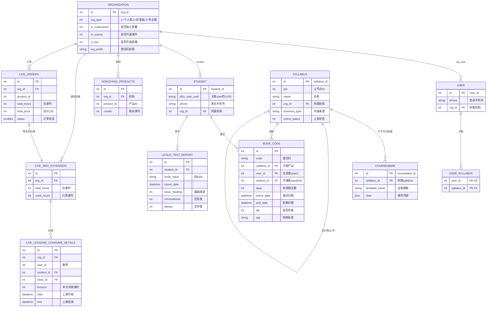
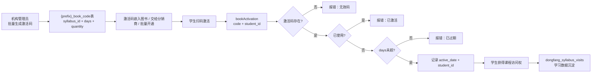
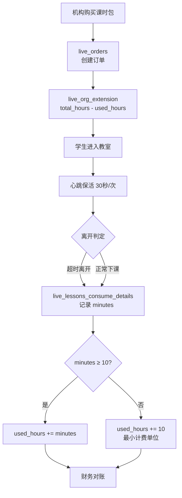
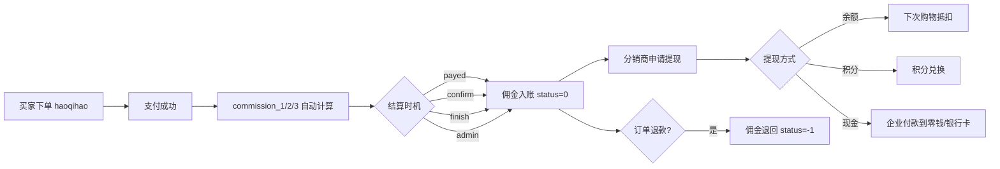

# iPlayABC 数据架构

> 生成时间: 2026-04-30
> 方法论: TOGAF C 层（数据架构）
> 目的: 建立核心实体关系图，支撑多产品线数据治理

---

## 一、数据架构总览

### 核心实体关系图（Mermaid ER）



### 核心实体及其关系（文字版）

```
┌─────────────────────────────────────────────────────────────────┐
│                      机构（Organization）                        │
│   org_id, org_type, is_customized, is_course, is_live           │
└────────────────────────┬────────────────────────────────────────┘
                         │
          ┌──────────────┼──────────────┐
          │              │              │
          ▼              ▼              ▼
┌─────────────┐  ┌─────────────┐  ┌─────────────┐
│  user表     │  │  student表  │  │ dongfang_   │
│  教师/管理员 │  │  学生账号   │  │ products表  │
│  user_id    │  │  student_id │  │ 机构产品授权 │
└─────────────┘  └──────┬──────┘  └─────────────┘
                         │
                         ▼
                  ┌─────────────┐
                  │ book_code表  │
                  │ 激活码/开通  │
                  │ user_id      │
                  │ student_id   │
                  │ syllabus_id  │
                  └──────┬──────┘
                         │
                         ▼
                  ┌─────────────┐
                  │  syllabus表  │
                  │  课程大纲    │
                  │  产品包      │
                  └──────┬──────┘
                         │
                         ▼
                  ┌─────────────┐
                  │ courseware表 │
                  │  具体课件   │
                  │  视频/游戏  │
                  └─────────────┘
```

---

## 二、核心实体详解

### 2.1 机构（Organization）

**表**: `organization`

| 字段 | 类型 | 说明 |
|------|------|------|
| `id` | INT | 主键 |
| `org_type` | INT | 机构类型：1=个人版，2=标准版，3=专业版 |
| `is_customized` | INT | 是否定制客户（独立部署） |
| `is_course` | INT | 是否开通课件功能 |
| `is_live` | INT | 是否开通直播课功能 |
| `org_prefix` | VARCHAR | 激活码前缀（如 `dige`） |

**业务规则**:
- `org_type` 决定功能权限和价格
- `is_customized` = 1 表示独立部署（大客户），数据完全隔离

---

### 2.2 用户（User）

**表**: `user`

| 字段 | 类型 | 说明 |
|------|------|------|
| `id` | INT | 主键（user_id） |
| `phone` | VARCHAR | 登录手机号 |
| `org_id` | INT | 所属机构（外键） |

**业务规则**:
- `user` 表是教师/管理员账号，**不是学生账号**
- 通过 `org_user` 表建立 user ↔ organization 的归属关系
- 学生账号走独立的 `student` 表

---

### 2.3 学生（Student）

**表**: `student`

| 字段 | 类型 | 说明 |
|------|------|------|
| `id` | INT | 主键（student_id） |
| `dfzx_user_uuid` | VARCHAR | 关联 user 表的 UUID |
| `phone` | VARCHAR | 家长手机号 |
| `org_id` | INT | 所属机构 |

**业务规则**:
- 学生和用户是**两套独立账号体系**
- 通过 `dfzx_user_uuid` 实现关联（一个家长手机号可绑多个学生）
- 学生归属机构，用于数据隔离

---

### 2.4 课程大纲 / 产品包（Syllabus）

**表**: `syllabus`

| 字段 | 类型 | 说明 |
|------|------|------|
| `id` | INT | 主键 |
| `pid` | INT | 父节点（0=根） |
| `name` | VARCHAR | 名称 |
| `org_id` | INT | 所属机构 |
| `business_type` | VARCHAR | 内容来源：`iteachabc_courseware`（自研）vs `dfzx_istudy_app`（第三方） |
| `online_status` | INT | 上架状态：0=下架，1=上架 |

**表**: `syllabus_book`

| 字段 | 类型 | 说明 |
|------|------|------|
| `id` | INT | 主键 |
| `syllabus_id` | INT | 关联 syllabus |
| `cover_image` | VARCHAR | 封面图 |
| `courseware_type` | VARCHAR | 课件类型（video/book/game） |

**业务规则**:
- Syllabus 是**树形结构**（pid 自引用）
- 叶子节点挂载具体 courseware
- 树形结构支持按章节/模块销售或赠送
- ⚠️ 定价（price）字段在代码中**不存在**

---

### 2.5 课件（Courseware）

**表**: `courseware`

| 字段 | 类型 | 说明 |
|------|------|------|
| `id` | INT | 主键 |
| `syllabus_id` | INT | 所属 syllabus |
| `template_name` | VARCHAR | 渲染模板（video_player/game/scene） |
| `data` | JSON | 课件内容数据 |
| `business_type` | VARCHAR | 内容来源 |

**业务规则**:
- `data` 是 JSON，存储课件的具体内容
- 前端根据 `template_name` 决定渲染方式
- 课件类型：视频、游戏、练习、阅读等

---

### 2.6 激活码 / 开通记录（Book Code）

**表**: `{prefix}_book_code`

| 字段 | 类型 | 说明 |
|------|------|------|
| `id` | INT | 主键 |
| `code` | VARCHAR | 激活码（格式：`{org_prefix}\|\|{16位UUID}`） |
| `syllabus_id` | INT | 关联 syllabus（产品） |
| `user_id` | INT | 关联 user（教师/管理员，生成者） |
| `student_id` | INT | 关联 student（学生，开通者） |
| `days` | INT | 有效期天数 |
| `active_date` | DATETIME | 激活日期 |
| `end_date` | DATETIME | 到期日期 |
| `del` | INT | 是否作废：0=正常，1=已作废 |
| `tag` | VARCHAR | 特殊标签（如 `buy_540`，影响有效期） |

**业务规则**:
- 激活码格式：`{机构prefix}\|\|{UUID}`，确保唯一性和可追溯
- `del=1` 表示作废，但**已激活的记录不追溯**（即作废后已开通的仍有效）
- 14 天试用：同一个 syllabus 只能激活一次 14 天试用
- 批量激活一次最多 300 个
- `buy_540` 标签：买 365 天给 487 天（机构折扣）

---

### 2.7 机构产品授权（Dongfang Products）

**表**: `dongfang_products`

| 字段 | 类型 | 说明 |
|------|------|------|
| `id` | INT | 主键 |
| `org_id` | INT | 机构 |
| `product_id` | INT | 产品 ID |
| `credits` | INT | 剩余课时/余额 |

**表**: `dongfang_products_credits`

| 字段 | 类型 | 说明 |
|------|------|------|
| `id` | INT | 主键 |
| `org_id` | INT | 机构 |
| `product_id` | INT | 产品 |
| `total_credits` | INT | 总课时 |
| `used_credits` | INT | 已用课时 |

---

### 2.8 直播课订单（Live Orders）

**表**: `live_orders`

| 字段 | 类型 | 说明 |
|------|------|------|
| `id` | INT | 主键 |
| `org_id` | INT | 机构 |
| `product_id` | INT | 产品包 ID |
| `total_hours` | INT | 总课时数 |
| `status` | INT | 订单状态 |

**表**: `live_org_extension`

| 字段 | 类型 | 说明 |
|------|------|------|
| `id` | INT | 主键 |
| `org_id` | INT | 机构 |
| `total_hours` | INT | 总课时 |
| `used_hours` | INT | 已用课时 |

**表**: `live_lessons_consume_details`

| 字段 | 类型 | 说明 |
|------|------|------|
| `id` | INT | 主键 |
| `org_id` | INT | 机构 |
| `student_id` | INT | 学生 |
| `lesson_id` | INT | 课程 |
| `minutes` | INT | 实际上课分钟数 |
| `consume_time` | DATETIME | 消耗时间 |

---

### 2.9 学习进度（ Syllabus Visits）

**表**: `dongfang_syllabus_visits`

| 字段 | 类型 | 说明 |
|------|------|------|
| `id` | INT | 主键 |
| `student_id` | INT | 学生 |
| `courseware_id` | INT | 课件 |
| `enter_time` | DATETIME | 进入时间 |
| `last_heartbeat` | DATETIME | 最后心跳 |
| `duration` | INT | 学习时长（秒） |

---

### 2.10 Lexile 测评报告（Lexile Report）

**表**: `lexile_test_report`

| 字段 | 类型 | 说明 |
|------|------|------|
| `id` | INT | 主键 |
| `student_id` | INT | 学生 |
| `lexile_value` | VARCHAR | Lexile 分值（如 `820L`） |
| `report_date` | DATETIME | 报告日期 |
| `basic_reading` | INT | 基础阅读得分 |
| `informational` | INT | 信息类得分 |
| `literary` | INT | 文学类得分 |

---

## 三、数据流转图

### 3.1 激活码生命周期



### 3.2 直播课课时消耗



### 3.3 分销佣金流转



---

## 四、数据架构关键发现

### 4.1 数据孤岛问题

| 问题 | 影响 | 优先级 |
|------|------|--------|
| 激活码和付款没有直接绑定 | 无法自动追溯"哪个码对应哪笔付款" | P0 |
| haoqihao 分销独立于 iPlayABC | 两套账，佣金对账复杂 | P1 |
| 定价数据不在代码里 | 价格靠人工管理 | P0 |
| 退款逻辑缺失 | 财务风险 | P0 |

### 4.2 多租户隔离机制

| 隔离维度 | 机制 | 说明 |
|---------|------|------|
| AppID 隔离 | 不同 AppID 连接不同数据库 | 早期方案 |
| Organization 隔离 | `org_id` 字段在所有表 | 当前方案 |
| Prefix 隔离 | 表名前缀（`{prefix}_book_code`） | 激活码表特有 |

### 4.3 两代架构数据模型差异

| 维度 | 旧体系（digejiaoyu1） | 新体系（剑津 NestJS） |
|------|----------------------|---------------------|
| 架构 | 单体，跨库 JOIN | 微服务，独立 DB |
| 授权 | book_code 表 | jianjin-course-entitlement |
| 用户 | user + student + org_user | jianjin-user 微服务 |
| 直播 | airclass 模块 | jianjin-schedule 微服务 |
| 通信 | 直接 SQL | NATS RPC |

---

## 五、数据治理建议

### 5.1 主数据管理（MDM）

| 实体 | 主数据属性 | 治理建议 |
|------|----------|---------|
| Organization | org_id, org_type, is_customized | 建立机构主表，统一多产品线 |
| User | user_id, phone, org_id | 统一用户中心（剑津已做） |
| Student | student_id, dfzx_user_uuid | 解决两套账号体系问题 |
| Syllabus | syllabus_id, business_type | 建立产品目录，统一上下架 |
| Courseware | courseware_id, template_name | 建立内容资产库 |

### 5.2 数据质量规则

| 规则 | 检查点 | 自动化？ |
|------|--------|--------|
| org_id 非空 | 所有业务表必须有 org_id | ✅ 可自动化 |
| 激活码唯一 | code 字段唯一约束 | ✅ 数据库约束 |
| 课时不超扣 | `used_hours <= total_hours` | ⚠️ 需要事务保证 |
| 学生归属机构 | student.org_id = book_code.org_id | ❌ 未检查 |

---

## 六、知识库文件索引

| 文件 | 覆盖的数据表 |
|------|------------|
| 知识库-业务知识框架.md | syllabus, courseware, book_code, dongfang_products |
| 知识库-激活与授权.md | {prefix}_book_code, dongfang_products |
| 知识库-学生使用旅程.md | student, dongfang_syllabus_visits |
| 知识库-直播课(airclass).md | live_orders, live_org_extension, live_lessons_consume_details |
| 知识库-Lexile分值体系.md | lexile_test_report |
| 知识库-系统架构全景.md | 微服务独立 DB |

---

*文档版本: v1.0*
*方法论: TOGAF C 层（数据架构）*
*下一步: 补充 ER 图可视化，建立主数据管理规范*
