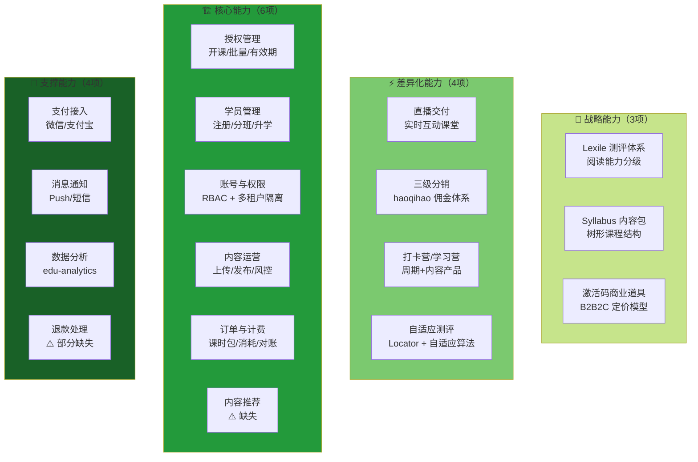
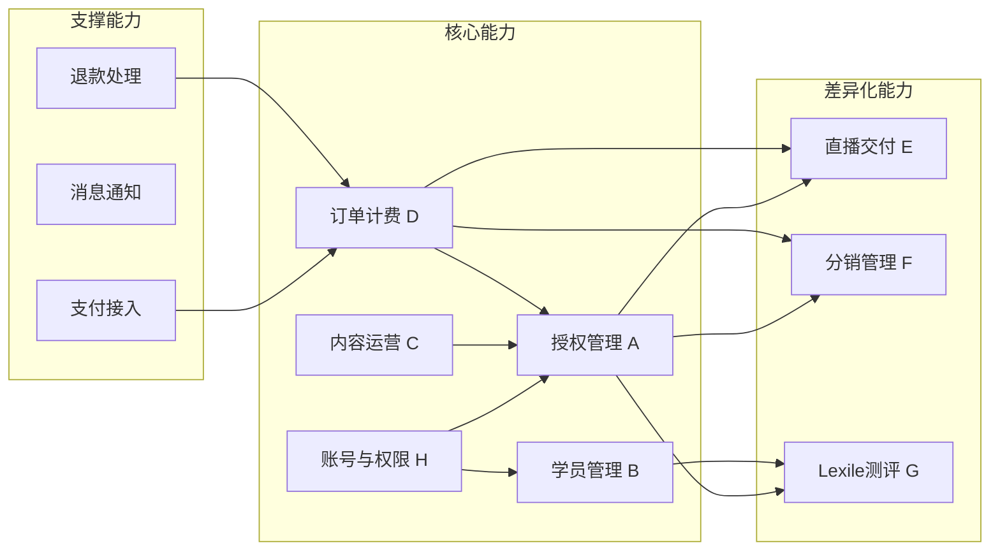
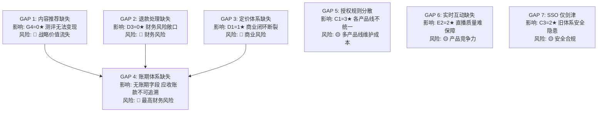

# iPlayABC 能力地图

> 生成时间: 2026-04-30
> 方法论: CPM（能力规划方法论）
> 执行内容: 能力分层 + 能力依赖 + 成熟度评级 + 差距分析

---

## 一、战略背景

**三大战略目标**（来自 iPlayABC 工厂团队）：

1. **缩短新产品交付周期** — 最优先，廖氏英语最紧迫
2. **降低多产品线维护成本** — 雪梨/剑津/阳光/KPI 等多产品线
3. **支撑 B2B SaaS 转型** — 从定制开发走向产品化订阅

**能力规划目的**：用"组织能做什么"而非"系统有什么功能"来组织知识库，让每个能力可以被多个产品线复用，从而支撑这三个目标。

---

## 二、能力分层（CPM Layer Model）

CPM 将能力分为四层：

| 层级 | 定义 | iPlayABC 对应 |
|------|------|-------------|
| **战略能力** | 决定市场定位的核心能力 | 内容资产（Lexile 测评体系） |
| **差异化能力** | 让产品与众不同的能力 | 直播交付、三级分销 |
| **核心能力** | 必须做好的基础能力 | 授权管理、学员管理、账号体系 |
| **支撑能力** | 基础设施能力 | 多租户隔离、支付接入、消息通知 |

### 2.1 能力分层矩阵

---

## 三、能力依赖关系图

能力之间存在依赖链，例如：学员管理依赖账号体系，授权管理依赖产品包定义。

### 依赖链解读

| 依赖链 | 说明 |
|--------|------|
| 账号(H) → 授权(A) → 直播(E)/分销(F)/测评(G) | 所有业务能力依赖账号体系 |
| 内容运营(C) → 授权(A) | 授权的前提是有产品可卖 |
| 订单计费(D) → 授权(A) | 计费的前提是有授权记录 |
| 支付(S1) → 订单(D) | 支付是计费的前置 |
| 退款(S4) → 订单(D) | 退款是计费的逆向 |

---

## 四、能力成熟度评级

每个能力按五级成熟度模型评估：

| 等级 | 定义 | 表现 |
|------|------|------|
| **1 - 初始** | 能力存在但过程不可预测 | 没有文档，靠人工，依赖个人 |
| **2 - 管理** | 能力有基本流程但未标准化 | 有文档，但各产品线不统一 |
| **3 - 定义** | 能力已标准化，跨产品线统一 | 统一文档，统一流程，统一 API |
| **4 - 量化** | 能力有量化指标，可监控 | 有 KPI，有 SLA，有监控仪表盘 |
| **5 - 优化** | 能力持续优化，有反馈闭环 | 数据驱动，持续迭代 |

### 4.1 成熟度评估矩阵

### 详细评级说明

#### G - 测评能力（战略层级）

| 能力 | 当前 | 目标 | 差距 |
|------|------|------|------|
| G1 Lexile 自适应测评 | ★★★★★ | ★★★★★ | 已达标，算法完整 |
| G2 等级测试（BOY/MOY/EOY） | ★★★☆☆ | ★★★★★ | 缺报告自动化推送 |
| G3 成绩报告 | ★★★☆☆ | ★★★★☆ | 三维分析有，数据可视化弱 |
| G4 内容推荐 | ☆☆☆☆☆ | ★★★★☆ | **完全缺失**，测评价值无法变现 |

#### C - 核心能力

| 能力 | 当前 | 目标 | 差距 |
|------|------|------|------|
| C1 授权管理 | ★★★☆☆ | ★★★★☆ | 各产品线规则不统一，代码分散 |
| C2 学员管理 | ★★☆☆☆ | ★★★☆☆ | 学习追踪有，但多端同步、升学自动化缺失 |
| C3 账号权限 | ★★☆☆☆ | ★★★☆☆ | RBAC 有，但 SSO 仅剑津新体系，旧体系混乱 |
| C4 内容运营 | ★★☆☆☆ | ★★★☆☆ | 上传/发布有，内容风控缺失 |
| C5 订单计费 | ★★☆☆☆ | ★★★☆☆ | 消耗记录完整，但定价无系统管理 |
| C6 内容推荐 | ☆☆☆☆☆ | ★★★★☆ | **完全缺失** |

#### D - 支撑能力

| 能力 | 当前 | 目标 | 差距 |
|------|------|------|------|
| D1 产品定价 | ★☆☆☆☆ | ★★★☆☆ | dongfang_products 有价，syllabus 无价，人工管理 |
| D2 支付接入 | ★★☆☆☆ | ★★★☆☆ | 有微信/支付宝接入，但没有统一支付网关抽象 |
| D3 退款处理 | ☆☆☆☆☆ | ★★★☆☆ | Lexile 有不支持退款声明，其他**完全缺失** |
| D4 课时消耗 | ★★★☆☆ | ★★★★☆ | 逻辑完整，但实时监控仪表盘缺失 |

---

## 五、能力 → 产品线复用矩阵

每个能力被哪些产品线使用（✅ = 深度使用，○ = 轻量使用，— = 不使用）：

| 能力 | 雪梨 | 剑津 | 阳光 | 凯狮 | 廖氏 | 说明 |
|------|------|------|------|------|------|------|
| G1 Lexile 测评 | ✅ | ✅ | ✅ | ✅ | — | 通用能力 |
| G2 等级测试 | ✅ | ✅ | ✅ | ✅ | — | 通用能力 |
| G3 成绩报告 | ✅ | ✅ | ✅ | ✅ | — | 通用能力 |
| G4 内容推荐 | — | — | — | — | — | **缺失** |
| C1 授权管理 | ✅ | ✅ | ✅ | ✅ | ✅ | 图书激活是雪梨核心 |
| C2 学员管理 | ✅ | ✅ | ✅ | ✅ | ✅ | 通用能力 |
| C3 账号权限 | ✅ | ✅ | ✅ | ✅ | ✅ | 通用能力 |
| C4 内容运营 | ✅ | ✅ | ✅ | ✅ | ✅ | 通用能力 |
| C5 订单计费 | ✅ | ✅ | ✅ | ✅ | ✅ | 通用能力 |
| D1 产品定价 | ✅ | ✅ | ✅ | ✅ | ✅ | 通用能力（但无系统管理） |
| D2 支付接入 | ✅ | ✅ | ✅ | ✅ | ✅ | 通用能力 |
| D3 退款处理 | — | — | — | — | — | **缺失** |
| D4 课时消耗 | ✅ | ✅ | ✅ | ✅ | ✅ | 通用能力 |
| E1 直播交付 | — | ✅ | ✅ | — | — | 剑津/阳光有 |
| F1 分销管理 | ✅ | — | — | — | — | 主要雪梨 |
| F2 三级分销 | ✅ | — | — | — | — | haoqihao 独立体系 |

---

## 六、能力差距分析（Gap Analysis）

### 6.1 按影响排序的差距

### 6.2 能力路线图（6个月）

| 阶段 | 时间 | 重点能力 | 目标 | 关键行动 |
|------|------|---------|------|---------|
| **Phase 0** | 立即 | 退款处理、账期体系 | 堵住财务风险 | 商务/财务/法务确认政策，补流程文档 |
| **Phase 1** | 1-2月 | 授权统一(C1)、账号统一(C3) | 降低多产品线维护成本 | 建立统一授权 API，迁移旧体系到 OPA |
| **Phase 2** | 2-4月 | 定价管理(D1)、支付网关(D2) | 商业闭环 | 建立价格主数据，抽象统一支付层 |
| **Phase 3** | 3-6月 | 内容推荐(G4) | 测评价值变现 | 实现 Lexile → 内容推荐算法 |

---

## 七、能力 Owner 映射

| 能力层级 | 能力 | 当前 Owner | 建议 Owner | 成熟度 |
|---------|------|----------|----------|--------|
| 战略 | G1~G3 测评 | 教研团队 | 教研团队 | 5★ |
| 战略 | **G4 内容推荐** | — | 教研+技术 | **0★ 缺失** |
| 核心 | C1 授权管理 | 运营? | 内容运营团队 | 3★ |
| 核心 | C2 学员管理 | 运营? | 教学服务团队 | 2★ |
| 核心 | C3 账号权限 | 技术 | 技术/安全团队 | 2★ |
| 核心 | C4 内容运营 | 运营? | 内容运营团队 | 2★ |
| 核心 | C5 订单计费 | 财务? | 财务团队 | 2★ |
| 支撑 | D1 定价 | — | 商务团队 | 1★ 缺失 |
| 支撑 | D2 支付接入 | 技术 | 技术团队 | 2★ |
| 支撑 | **D3 退款处理** | — | 财务/法务 | **0★ 缺失** |
| 支撑 | D4 课时消耗 | 技术 | 技术团队 | 3★ |
| 差异化 | E 直播交付 | 技术 | 技术团队 | 3★ |
| 差异化 | F 分销 | 运营? | 独立团队 | 3★ |

---

## 八、CPM 执行说明

### 本文档执行了哪些 CPM 步骤

| CPM 步骤 | 执行状态 | 说明 |
|---------|---------|------|
| **Step 1: 战略对齐** | ✅ | 对齐三大战略目标 |
| **Step 2: 能力识别** | ✅ | 识别 17 项能力，归为四层 |
| **Step 3: 能力分层** | ✅ | 战略/差异化/核心/支撑 四层 |
| **Step 4: 能力依赖分析** | ✅ | 识别 6 条依赖链 |
| **Step 5: 能力成熟度评估** | ✅ | 五级评级，17 项能力逐一评级 |
| **Step 6: 差距分析** | ✅ | 识别 7 个关键差距 |
| **Step 7: 路线图制定** | ✅ | 6 个月四阶段路线图 |
| **Step 8: Owner 映射** | ✅ | 17 项能力映射 Owner |

### 未执行的 CPM 步骤（需要业务团队参与）

| 步骤 | 原因 | 下一步 |
|------|------|--------|
| 能力 KPI 制定 | 需要与业务团队确认量化指标 | 工作坊讨论 |
| 能力 ROI 分析 | 需要财务数据支持 | 与财务团队对齐 |
| 能力组合优化 | 需要战略优先级排序 | CEO/产品负责人决策 |

---

*文档版本: v1.0*
*方法论: CPM（能力规划方法论）*
*执行: 战略对齐 → 能力识别 → 分层 → 依赖 → 成熟度 → 差距 → 路线图 → Owner*
